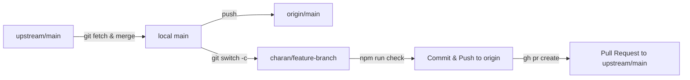

# KitchenBots E-Commerce Platform

> **Precision Meets Fire.**<br/>
> India's premier direct-to-consumer and B2B platform for engineered outdoor cooking systems, collapsible grills, rocket stoves, and heavy-duty live-fire culinary equipment.

[](https://react.dev/)
[](https://www.typescriptlang.org/)
[](https://vite.dev/)
[](https://tailwindcss.com/)
[](https://pages.cloudflare.com/)

---

## Overview

**KitchenBots** is an engineered outdoor cooking brand manufactured in India from high-grade ISI-qualified steel and heat-resistant ceramic coatings rated to 1000°C+.

This repository contains the complete frontend storefront web application (`kitchen-bots-ecommerce`), featuring a fluid responsive UI, zero-latency product zoom, interactive 120-frame 360° turntable viewers streamed from Cloudflare R2, unified cart and wishlist persistence, B2B wholesale enquiry capabilities, and cross-repo catalog synchronization with the operations dashboard.

---

## Key Features & User Experience

### 1. Interactive 360° Turntable & Media Viewer
- **Custom HTML5 Canvas 360° Engine**: Smooth multi-frame sequence scrubber supporting 120-frame high-resolution turntables.
- **Gesture & Mouse Controls**: Touch-drag, mouse-drag scrubbing, continuous auto-rotation toggle, 90° orientation snap pill, and manual step chevrons (`<` and `>`).
- **Cloudflare R2 CDN Streaming**: Optimized asset delivery with automatic path encoding for complex sequence names.
- **Canvas Viewport Observer**: Dynamic resize observer preventing distortion when switching between product media tabs.

### 2. Zero-Lag Hardware-Accelerated Product Zoom
- **Direct DOM Coordinate Engine**: Eliminates React Virtual DOM re-render lag during rapid mouse movement.
- **Instant Entrance Tracking**: Instantly sets `transformOrigin` to cursor entrance point with 0ms delay, scaling to `2.4x` for inspecting weld quality and steel gauge.
- **GPU Pre-decoding**: Gallery images pre-load and hardware-decompress directly into GPU memory via `img.decode()` and `decoding="sync"`.
- **Clean UI**: Image overlays removed in favor of seamless edge-to-edge cursor magnification.

### 3. Comprehensive Product Catalog & Quick View
- **Multi-Category Catalog**: Filter, search, and sort across 12 flagship models and accessories in grid or list layout.
- **Universal Quick View Modal**: Clicking any product card or title in the home fleet, catalog grid, wishlist, or related items drawer opens an immediate Quick View modal with full gallery, specs, zoom, and instant cart actions without page reloads.

### 4. Cart, Wishlist & Checkout System
- **Slide-Over Cart Drawer & Dedicated `/cart` Page**: Dual cart surfaces supporting quantity increments, item deletion, coupon discount engine, delivery estimate calculations, and GST invoicing breakdown.
- **Persistent Wishlist**: Save favorite items across browsing sessions with one-tap moves to cart.
- **Mobile Sticky Cart**: Context-aware floating navigation bar on handheld screens.

### 5. B2B & Commercial Bulk Enquiries
- **Dedicated Wholesale Portal (`/bulk-enquiry`)**: Tailored for restaurants, cloud kitchens, caterers, and outdoor hospitality businesses.
- **Contextual Pre-fill**: Initiating bulk inquiries from product pages pre-selects the product, estimated volume, and custom fabrication requirements.

### 6. Operations Catalog Synchronization
- **Single Source of Truth**: Product specs and category marketing in `src/data/products.ts` and `src/data/categories.ts` sync directly to the operations dashboard (`kitchen-bots-dashboard`) using the built-in sync pipeline.

---

## Product Categories

| Category | Slug | Flagship Highlights |
|---|---|---|
| **Collapsible BBQ** | `collapsible-bbq` | Interlocking bolt-free panel system, folds flat to 90mm in under 60 seconds, withstands 400°C. |
| **Rocket Stoves** | `rocket-stoves` | High-efficiency L-combustion chamber, secondary woodgas burn, 75% less fuel than open fires, rated to 1100°C. |
| **Automatic BBQ** | `automatic-bbq` | Dual-speed AC/DC motorized multi-skewer rotisserie, 304 food-grade stainless steel. |
| **Santa Maria Series** | `santa-maria` | Argentinian live-fire asado with 24-position crank-wheel elevation (400mm travel) and V-groove flare prevention grates. |
| **Suitcase BBQ** | `suitcase-bbq` | Ultra-portable 70mm fold-flat profile with integrated carry handles and setup in under 30 seconds. |
| **Accessories** | `accessories` | Heavy-duty SS skewers, weather-resistant covers, and cleaning tools engineered for KitchenBots gear. |

---

## Route Structure

| Route | Page Component | Description |
|---|---|---|
| `/` | `HeroSection`, `ProductFleetSection`, `CategorySection`, `CategoriesContactSection` | Homepage featuring brand hero, gear fleet, categories, and direct support cards. |
| `/products` | `ProductsPage.tsx` | Full catalog browsing, text search, category tabs, sort by price/rating/popularity. |
| `/product-detail?id=:id` | `ProductDetailPage.tsx` | Dedicated product page with 360° viewer, photo gallery, specs, dimensional blueprints, and customer reviews. |
| `/cart` | `CartPage.tsx` | Full-page shopping cart with delivery calculations, order breakdown, and checkout trigger. |
| `/wishlist` | `WishlistPage.tsx` | User-curated wishlist with quick-view and instant add-to-cart. |
| `/bulk-enquiry` | `BulkEnquiryPage.tsx` | B2B wholesale, corporate gifting, and commercial restaurant quotation form. |
| `/capabilities` | `CapabilitiesPage.tsx` | Engineering, CNC laser cutting, stress-relieving heat treatment, and fabrication standards. |
| `/about` | `AboutPage.tsx` | Brand heritage, mission, steel sourcing, and "Made in India" manufacturing ethos. |
| `/blog` | `BlogPage.tsx` | Live-fire grilling tutorials, rocket stove efficiency guides, recipes, and seasonal maintenance. |
| `/contact` | `ContactPage.tsx` | Location details, contact forms, and instant WhatsApp / Email support channels. |
| `/policies` | `PoliciesPage.tsx` | Shipping policy, 12-month manufacturing warranty, 10-year structural warranty, returns, and terms. |
| `/login` | `LoginPage.tsx` | User authentication, account access, and order tracking. |
| `/forgot-password` | `ForgotPasswordPage.tsx` | Account recovery and password reset workflow. |

---

## Architecture & Tech Stack

```
kitchen-bots-ecommerce/
├── src/
│   ├── components/         # Reusable UI components (Navigation, Footer, CartDrawer, etc.)
│   │   └── ui/             # Radix UI + shadcn primitive building blocks
│   ├── context/            # React state contexts (CartContext, WishlistContext, AuthContext, ToastContext)
│   ├── data/               # Product catalog, brand metadata, categories, FAQs
│   ├── hooks/              # Custom React utility hooks
│   ├── lib/                # CDN URL resolution, SEO meta generators, validation schemas
│   ├── modules/            # Sequence viewer algorithms, canvas renderer, media loader
│   ├── pages/              # Primary route views (Catalog, Detail, Cart, B2B, About, etc.)
│   ├── sections/           # Modular landing page sections
│   ├── types/              # TypeScript models for products, cart, orders, and UI
│   ├── App.tsx             # Root router, location listeners, and page transitions
│   ├── main.tsx            # Application entrypoint
│   └── index.css           # Tailwind directives, theme variables, and keyframe animations
├── scripts/
│   ├── sync-catalog.mjs    # Cross-repo synchronization between storefront and dashboard
│   └── upload-to-r2.mjs    # Asset uploader for Cloudflare R2 media buckets
├── public/                 # Static assets, favicon, robots.txt, sitemap.xml
├── wrangler.jsonc          # Cloudflare Pages / Workers deployment config
└── vite.config.ts          # Vite build, code-splitting chunks, and asset configurations
```

### Core Technologies
- **Framework**: [React 19](https://react.dev/) + [TypeScript](https://www.typescriptlang.org/)
- **Bundler & Dev Server**: [Vite 7](https://vite.dev/)
- **Styling**: [Tailwind CSS 3.4](https://tailwindcss.com/) with custom design system variables
- **UI Primitives**: [Radix UI](https://www.radix-ui.com/) + [shadcn/ui](https://ui.shadcn.com/)
- **Animation & Motion**: [Framer Motion](https://www.framer.com/motion/) + [GSAP 3](https://greensock.com/gsap/) with ScrollTrigger
- **Icons**: [Lucide React](https://lucide.dev/)
- **3D & Canvas Graphics**: [Three.js](https://threejs.org/) + custom high-performance HTML5 2D Canvas turntable engine
- **Media Hosting**: [Cloudflare R2](https://www.cloudflare.com/developer-platform/r2/)
- **Unit Testing**: [Vitest](https://vitest.dev/)
- **Linting & Hygiene**: [ESLint 9](https://eslint.org/) flat config + TypeScript strict checks

---

## Getting Started

### Prerequisites
- **Node.js**: `^22.12.0` (or `^20.0.0`)
- **npm**: `^10.0.0`
- **Git** & **GitHub CLI (`gh`)**

### 1. Installation
Clone your fork of the repository and install dependencies:

```bash
git clone https://github.com/<your-username>/kitchen-bots-ecommerce.git
cd kitchen-bots-ecommerce
npm install
```

### 2. Environment Configuration
Copy the template environment file:

```bash
cp .env.example .env
```

Configure your environment variables as needed:
```env
VITE_R2_PUBLIC_URL="https://assets.kitchenbots.in"
VITE_API_URL="https://api.kitchenbots.in"
```

### 3. Start Development Server
```bash
npm run dev
```
The site will run locally at `http://localhost:5173`.

---

## Available Scripts

| Command | Action |
|---|---|
| `npm run dev` | Starts Vite local development server with Hot Module Replacement (HMR). |
| `npm run typecheck` | Executes TypeScript typecheck (`tsc -b`) across all files. |
| `npm run lint` | Runs ESLint to verify code quality and style consistency. |
| `npm run test` | Executes unit tests with Vitest. |
| `npm run build` | Compiles production bundle with code splitting into `dist/`. |
| `npm run check` | Runs full pre-commit gate: `typecheck` + `lint` + `test` + `build`. |
| `npm run preview` | Spins up a local preview server for the built `dist/` directory. |
| `npm run sync:catalog` | Synchronizes product and category data with `kitchen-bots-dashboard`. |
| `npm run sync:catalog:check` | Verifies that storefront and dashboard catalogs are in sync without writing. |
| `npm run deploy` | Builds the project and deploys to Cloudflare Pages via Wrangler. |

---

## Daily Git & Contribution Workflow

Always adhere to the repository workflow:



### 1. Start Work
```bash
git switch main
git fetch upstream
git merge --ff-only upstream/main
git push origin main
git switch -c charan/<task-name>
```

### 2. Commit Changes
```bash
git add <path/to/files>
git diff --cached --check
npm run check
git commit -m "feat: describe the change"
git push -u origin HEAD
```

### 3. Open Pull Request
```bash
gh pr create \
  --repo kitchen-bots/kitchen-bots-ecommerce \
  --base main \
  --head "workofcharan:$(git branch --show-current)"
```

### 4. Follow-up Changes on the Same PR
```bash
git add <path/to/files>
npm run check
git commit -m "fix: describe the correction"
git push
```

---

## Quality Gate & Performance Standards

Before merging to `main` or tagging a release:
- Zero TypeScript (`tsc -b`) errors.
- Zero ESLint warnings or errors.
- 100% test pass rate in Vitest.
- Clean production build with optimized vendor chunking (`vendor-react`, `vendor-lucide`, `vendor-gsap`).
- Verified responsive layouts from 360px mobile through 2560px ultra-wide screens.
- Zero layout shift (CLS) on high-resolution image sequences and product heroes.

---

© 2026 KitchenBots India. All rights reserved. Precision Meets Fire.
